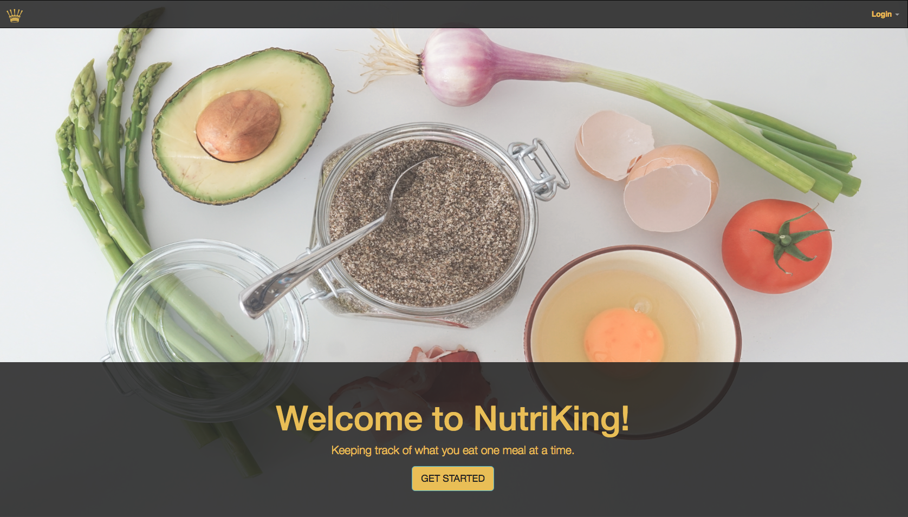
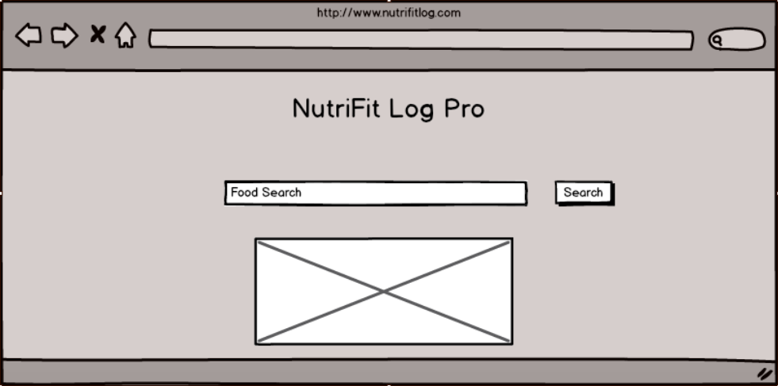
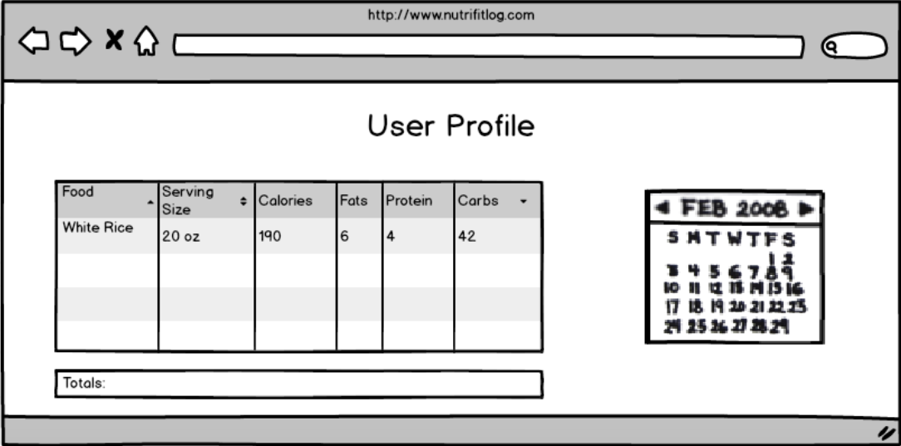

# WDI Project 3: NutriKing

NutriKing was created by Lawrence Gomez, Shahrooz Hedayati and Hines Kao as their third project for General Assembly's WDI course in Santa Monica.

### Objective

NutriKing is a health oriented site where the user can log and track their meals during the day to see how many calories they've consumed.

### Installation

No installation required, click [here](https://mighty-inlet-45127.herokuapp.com/) to acccess the site and get started!

### Project Requirements

The guidelines listed below were provided by the project markdown:

* User of MongoDB and Express to create data CRUD
* Produce a RESTful API that expresses at least one model
* Consume its own API using AJAX
* Authenticate users using at least one OAuth provider
* Restrict access to the Creation, Updating, and Deletion of resources using an authorization middleware function
* Be deployed online using Heroku

Necessary Deliverables

* A [pitch deck](Pitch_Deck.pptx), delivered as a team to the instructors
* A working app, built by the whole team, hosted somewhere on the Internet
* A client application that consumes our own API, hosted somewhere on the internet
* A link to our hosted, working app in the URL section of our Github repo
* A Git repository hosted on Github, with frequent commits from every team member dating back to the very beginning of the project

### MVP

* A working login page that includes both local and OAuth login options
* A working create account feature that allows users to create a NutriKing account
* The ability for users to create, edit, and delete a profile
* The ability for users to create, edit and delete meals
* The ability for users to be able to view logs from previous meals added

### Technologies/Frameworks used

* HTML5
* CSS
* Javascript
* jQuery
* AJAX
* Node.js
* Express.js
* MongoDB.js
* [Trello Board](https://trello.com/b/3qa7Cvoq/project-3)

### Approach taken

1. We started by drawing out our Wireframes to a diagram and to plan our project.
2. After that, we made a planning board and wrote user stories using Trello.
3. We created models, views, and controllers for our app. We achieved full CRUD using RESTful routing.
4. Lastly, after all the debugging, we deployed the project to Heroku.

### Future Implementations

* The ability to create a meal plan for weight loss
* The ability to have autocomplete function for the search bar
* The ability for users being able to upload a before and after picture
* The ability to have the meal history of the user to be displayed in a calendar
